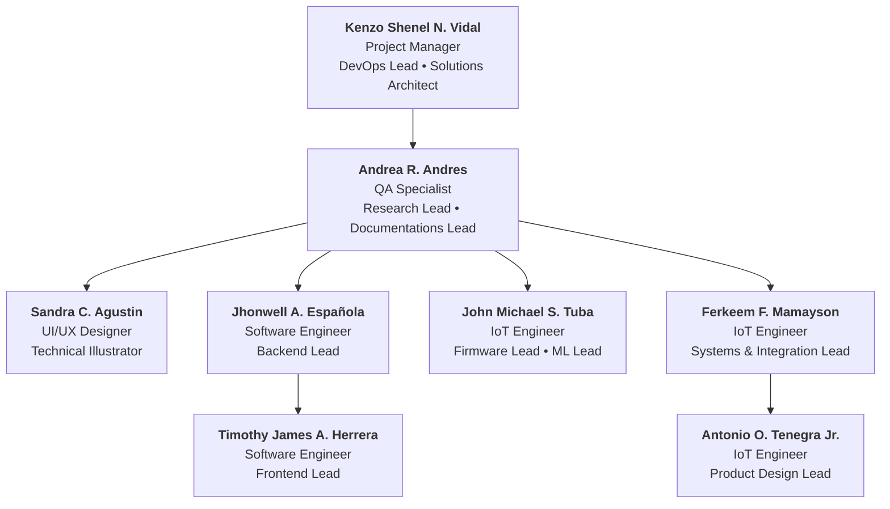

<p align="center">
  
</p>




# **SORA**

This document serves as the operational guide and engineering pipeline specification for SORA. It outlines the repository architecture, project board governance, and development workflows for the ALAMOK ecosystem.

**ALAMOK** (Autonomous Larvicidal AI-Driven Mosquito Ovitrap and Killer) is an off-grid, solar-powered IoT mosquito control system. It integrates edge-AI computer vision (Raspberry Pi co-processor) for automated larvae detection, low-power microcontrollers (ESP32) for fluid management and power orchestration, point-to-point LoRa/BLE telemetry, and dedicated desktop/mobile client applications to monitor and automate larvicide dispatch.

---

## Repository Architecture

The system employs a Domain-Driven Isolation strategy across six dedicated repositories to maintain clear boundaries between hardware, AI, software, institutional web portal, documentation, and system deployment components:

| Repository | Focus Area | Primary Technology Stack | Contributors |
| :--- | :--- | :--- | :--- |
| **`ALAMOK-Hardware`** | Power management, sensor integration, fluid actuation, telemetry | ESP32-WROOM-32, DS3231 RTC, SX1278 LoRa, 12V LiFePO4 Battery, 20W Solar Panel, Solenoid Valves, Peristaltic Pumps, JSN-SR04T Ultrasonic Sensors, C++, PlatformIO | Ferkeem, Antonio, John Michael |
| **`ALAMOK-Software`** | Ingestion server, REST/WebSocket API, dashboard (BOMT), mobile diagnostic utility | React, React Native (Expo), Electron, TypeScript, TailwindCSS, MapboxGL, FastAPI, NestJS, PostgreSQL, Redis, Socket.io | Jhonwell, Timothy, Kenzo |
| **`ALAMOK-Institutional-Portal`** | B2G municipal stakeholder portal, public outbreak information showcase, product engagement, and demo scheduling | Next.js (App Router), TypeScript, TailwindCSS, Framer Motion, Vercel, Figma UI/UX Design System | Sandra |
| **`ALAMOK-ML`** | Computer vision pipeline & edge inference models | Raspberry Pi 4B, Pi Camera Module 3, TensorFlow Lite, YOLO-Fastest, OpenCV, Python | John Michael |
| **`ALAMOK-Documentation`** | Thesis manuscript, BOM, UAT protocols, field logs | System Architecture Diagrams, Markdown | All Members (Lead: Andrea) |
| **`ALAMOK-System-Release`** | System orchestration, submodule sync, release manifests | Git Submodules, SemVer, GitHub Actions | Kenzo |

---

## Project Management & Governance

To maintain operational clarity and prevent status clutter, software engineering tasks are separated from academic writing processes using two dedicated project boards per ADR-0021.

```text
SORA Organization
 ├── ALAMOK Engineering Board  (ALAMOK-Hardware, Software, Institutional-Portal, ML, System-Release)
 └── ALAMOK Thesis Track Board (ALAMOK-Documentation)
```

### 1. ALAMOK Engineering Board
Tracks all technical execution across hardware, edge AI, software, institutional portal, and system releases. 

*Note: Task statuses are fully automated via GitHub Workflows to minimize manual toggling.*

**Automated Lifecycle Stages:**  
`To Do` ➔ `In Review` *(PR Opened)* ➔ `Staging` *(PR Merged)* ➔ `Production` *(Merged to Main)*

**Standard Issue Tagging Prefixes:**
- `ALAMOK-Hardware`: `[ HW ]`, `[ FW ]`, `[ IoT ]`
- `ALAMOK-Software`: `[ FE ]`, `[ BE ]`, `[ DevOps ]`, `[ Milestone ]`
- `ALAMOK-Institutional-Portal`: `[ FE ]`, `[ Design ]`
- `ALAMOK-ML`: `[ ML ]`
- `ALAMOK-System-Release`: `[ Release ]`, `[ Milestone ]`

### 2. ALAMOK Thesis Track Board
Tracks academic compliance, chapter revisions, field testing data, and adviser feedback.

**Lifecycle Stages:**  
`To Do` ➔ `In Progress` ➔ `Done`

**Standard Issue Tagging Prefixes:**
- `ALAMOK-Documentation`: `[ Research ]`, `[ Docs ]`

---

## Team Roles & Maintainers

| Name | Role | GitHub Account |
| :--- | :--- | :--- |
| **Vidal, Kenzo Shenel N.** | Project Manager / Lead DevOps & Systems Architect | [@kzc0des](https://github.com/kzc0des) |
| **Española, Jhonwell A.** | Backend & Core Systems Engineer | [@ryu-zaki](https://github.com/ryu-zaki) |
| **Herrera, Timothy James** | Frontend Engineer | [@JujuDecoder](https://github.com/JujuDecoder) |
| **Agustin, Sandra C.** | UI/UX Designer & Technical Illustrator | [@sandytrtl](https://github.com/sandytrtl) |
| **Andres, Andrea C.** | Research & Documentation Lead / Quality Assurance (QA) | [@wippiiee](https://github.com/wippiiee) |
| **Mamayson, Ferkeem F.** | IoT Systems & Electronics Engineer | [@Ysokii](https://github.com/Ysokii) |
| **Tenegra, Antonio** | Hardware Product Designer | [@Ji-stacks](https://github.com/Ji-stacks) |
| **Tuba, Michael John S.** | Firmware Engineer | [@jeyem07](https://github.com/jeyem07) |
